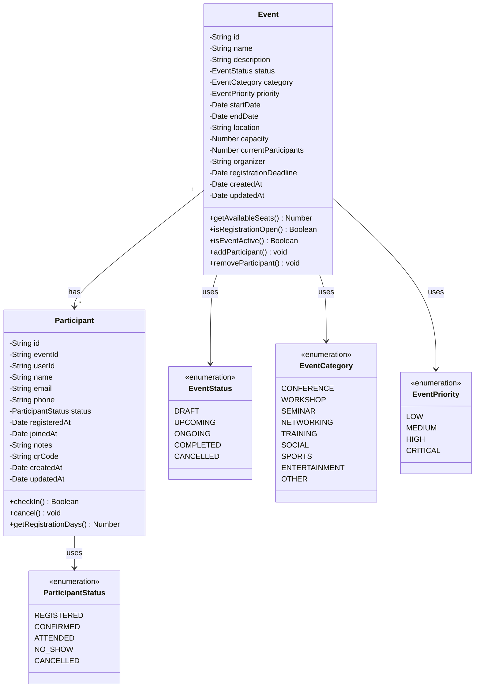
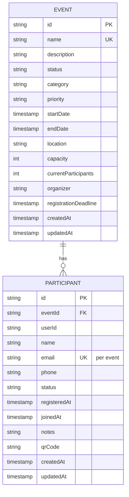
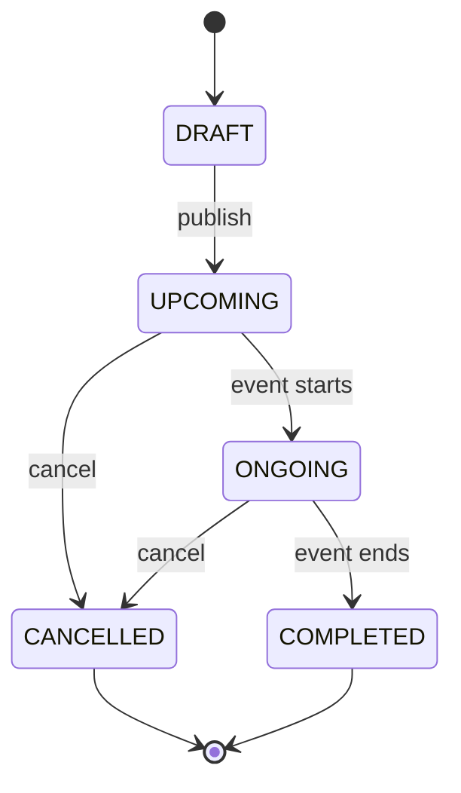
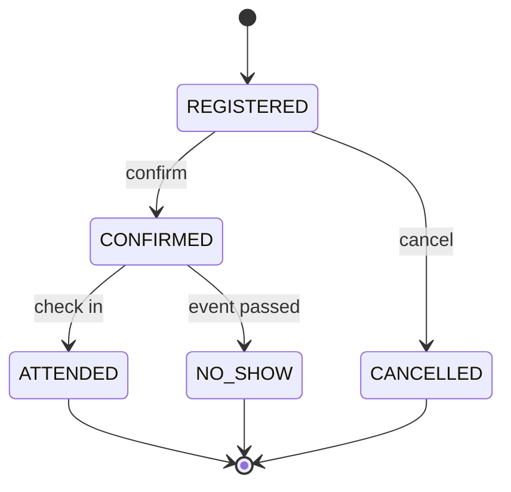

# UML Class Diagram - Event Management System

## Overview
เอกสารนี้แสดง UML Class Diagram สำหรับระบบจัดการกิจกรรม

---

## UML Class Diagram



---

## Entity Relationship Diagram (ERD)



---

## Class Relationships Explanation

### 1. One-to-Many Relationship (Event → Participant)
- **Multiplicity:** 1 Event has Many Participants
- **Foreign Key:** `Participant.eventId` references `Event.id`
- **Description:** แต่ละกิจกรรมสามารถมีผู้เข้าร่วมหลายคน และแต่ละผู้เข้าร่วมสามารถอ้างอิงถึงกิจกรรมเดียวเท่านั้น

### 2. Enum Relationships
- **Event → EventStatus:** แต่ละ Event มี status เพียงหนึ่งเดียว
- **Event → EventCategory:** แต่ละ Event คือหมวดหมู่เดียวเท่านั้น
- **Event → EventPriority:** แต่ละ Event มีลำดับความสำคัญเพียงหนึ่งเดียว
- **Participant → ParticipantStatus:** แต่ละ Participant มีสถานะการเข้าร่วมเพียงหนึ่งเดียว

---

## Attribute Descriptions

### Event Class Attributes

| Attribute | Type | Visibility | Description |
|-----------|------|------------|-------------|
| `id` | String | Private | Unique identifier (UUID) |
| `name` | String | Private | Event name |
| `description` | String | Private | Event description |
| `status` | EventStatus | Private | Current status |
| `category` | EventCategory | Private | Event category |
| `priority` | EventPriority | Private | Priority level |
| `startDate` | Date | Private | Start date and time |
| `endDate` | Date | Private | End date and time |
| `location` | String | Private | Physical location |
| `capacity` | Number | Private | Maximum participants |
| `currentParticipants` | Number | Private | Current participant count |
| `organizer` | String | Private | Organizer name/organization |
| `registrationDeadline` | Date | Private | Registration deadline |
| `createdAt` | Date | Private | Record creation timestamp |
| `updatedAt` | Date | Private | Last update timestamp |

### Event Class Methods

| Method | Return Type | Description |
|--------|-------------|-------------|
| `getAvailableSeats()` | Number | Returns `capacity - currentParticipants` |
| `isRegistrationOpen()` | Boolean | Checks if registration is still open (before deadline) |
| `isEventActive()` | Boolean | Checks if event is currently happening |
| `addParticipant()` | void | Increments `currentParticipants` |
| `removeParticipant()` | void | Decrements `currentParticipants` |

### Participant Class Attributes

| Attribute | Type | Visibility | Description |
|-----------|------|------------|-------------|
| `id` | String | Private | Unique identifier (UUID) |
| `eventId` | String | Private | Foreign key to Event |
| `userId` | String | Private | User identifier |
| `name` | String | Private | Participant name |
| `email` | String | Private | Participant email |
| `phone` | String | Private | Phone number (optional) |
| `status` | ParticipantStatus | Private | Current status |
| `registeredAt` | Date | Private | Registration timestamp |
| `joinedAt` | Date | Private | Actual join timestamp |
| `notes` | String | Private | Additional notes |
| `qrCode` | String | Private | QR code for check-in |
| `createdAt` | Date | Private | Record creation timestamp |
| `updatedAt` | Date | Private | Last update timestamp |

### Participant Class Methods

| Method | Return Type | Description |
|--------|-------------|-------------|
| `checkIn()` | Boolean | Process check-in and set `joinedAt` |
| `cancel()` | void | Cancel participation and update status |
| `getRegistrationDays()` | Number | Calculate days since registration |

---

## Constraints and Rules

### Event Constraints
```
1. startDate < endDate
2. registrationDeadline ≤ startDate
3. capacity > 0
4. currentParticipants ≤ capacity
5. name is unique
6. location is not empty
```

### Participant Constraints
```
1. email is valid format
2. eventId must reference existing Event
3. Unique constraint: (eventId, userId)
4. currentParticipants of Event increments on creation
5. currentParticipants of Event decrements on deletion
```

---

## State Diagrams

### Event Status State Diagram



### Participant Status State Diagram



---

## Database Schema Mapping

### Event Table
```sql
CREATE TABLE events (
    id VARCHAR(36) PRIMARY KEY,
    name VARCHAR(255) NOT NULL UNIQUE,
    description TEXT NOT NULL,
    status VARCHAR(20) NOT NULL,
    category VARCHAR(20) NOT NULL,
    priority VARCHAR(20) NOT NULL,
    start_date DATETIME NOT NULL,
    end_date DATETIME NOT NULL,
    location VARCHAR(255) NOT NULL,
    capacity INT NOT NULL,
    current_participants INT NOT NULL DEFAULT 0,
    organizer VARCHAR(255) NOT NULL,
    registration_deadline DATETIME NOT NULL,
    created_at TIMESTAMP DEFAULT CURRENT_TIMESTAMP,
    updated_at TIMESTAMP DEFAULT CURRENT_TIMESTAMP ON UPDATE CURRENT_TIMESTAMP,
    CHECK (capacity > 0),
    CHECK (start_date < end_date),
    CHECK (registration_deadline <= start_date)
);
```

### Participant Table
```sql
CREATE TABLE participants (
    id VARCHAR(36) PRIMARY KEY,
    event_id VARCHAR(36) NOT NULL,
    user_id VARCHAR(255) NOT NULL,
    name VARCHAR(255) NOT NULL,
    email VARCHAR(255) NOT NULL,
    phone VARCHAR(20),
    status VARCHAR(20) NOT NULL,
    registered_at DATETIME NOT NULL,
    joined_at DATETIME,
    notes TEXT,
    qr_code VARCHAR(255),
    created_at TIMESTAMP DEFAULT CURRENT_TIMESTAMP,
    updated_at TIMESTAMP DEFAULT CURRENT_TIMESTAMP ON UPDATE CURRENT_TIMESTAMP,
    FOREIGN KEY (event_id) REFERENCES events(id),
    UNIQUE KEY unique_event_user (event_id, user_id)
);
```
